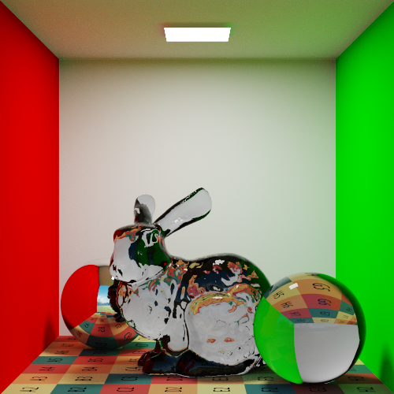
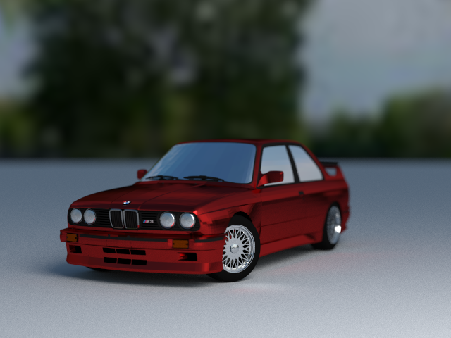
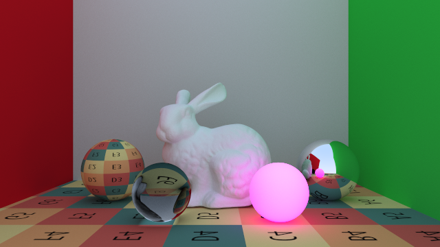
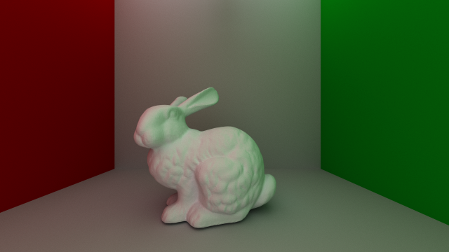
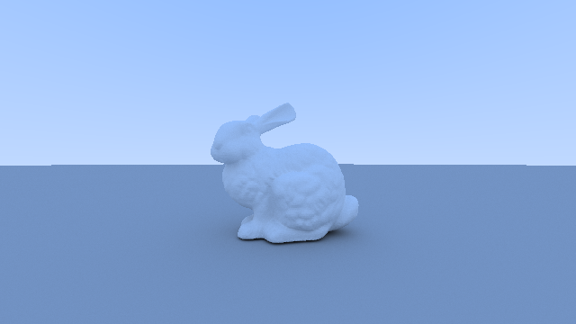

# Pathtracer

This is my toy monte-carlo path tacer.

## Features

-   Obj loading
-   Textures
-   Environment maps
-   Dielectrics (refraction and caustics)
-   Emissive materials
-   Bounding volume hierarchy
-   Depth of field

## Build

```bash
mkdir build && cd build
cmake ..
cmake --build .
```

## Results











